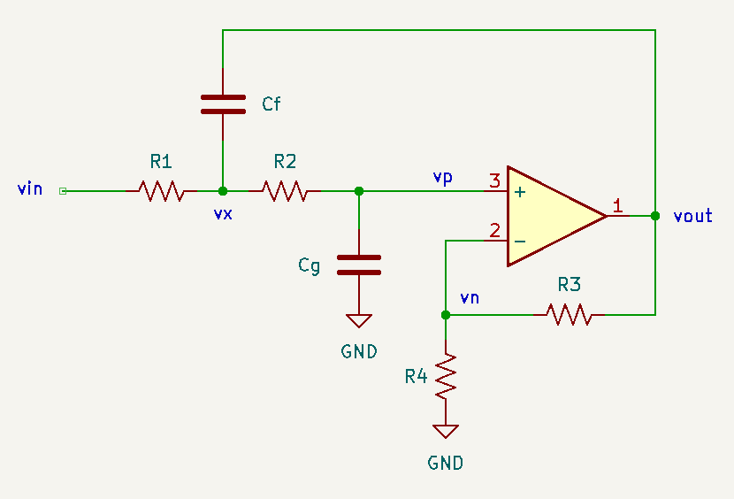
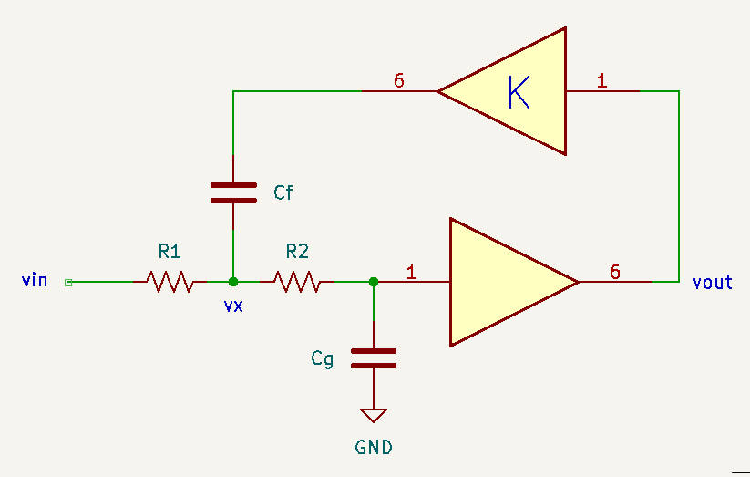
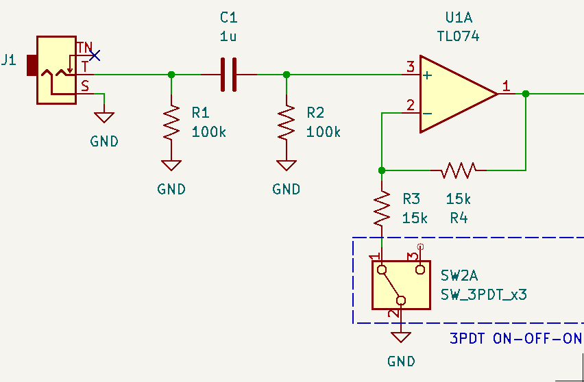
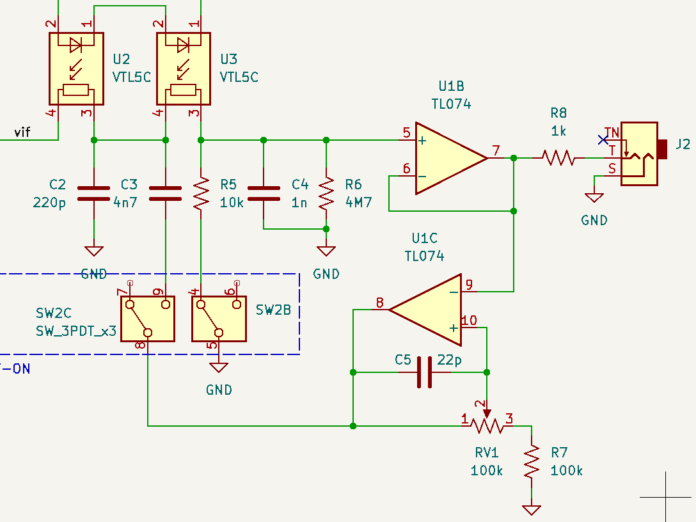
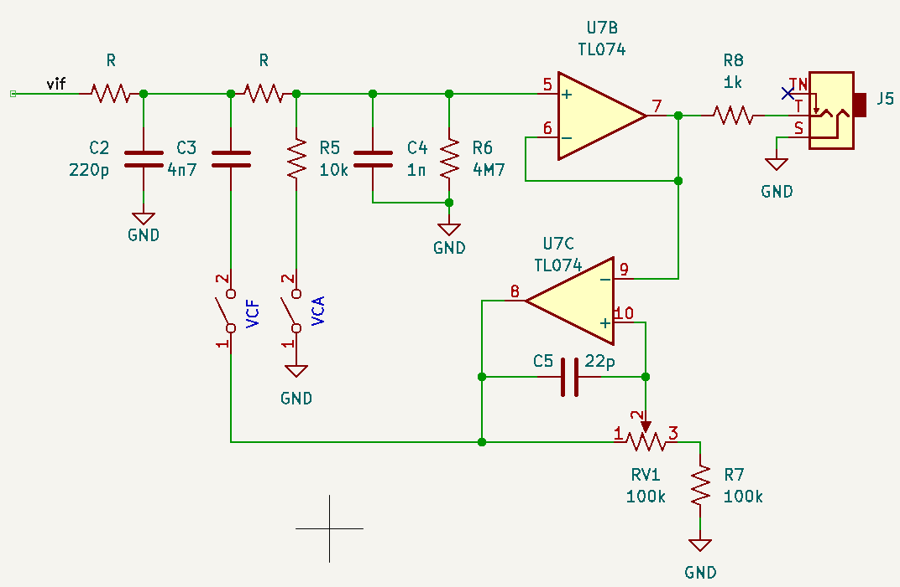
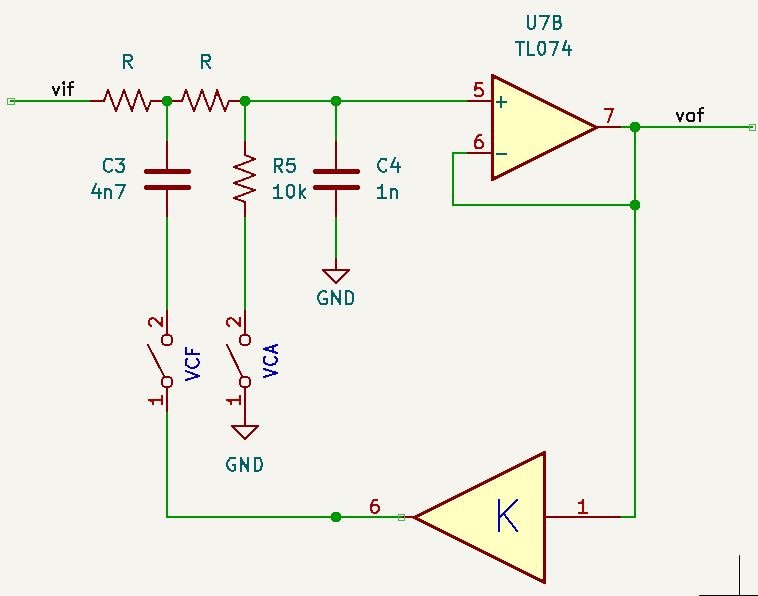
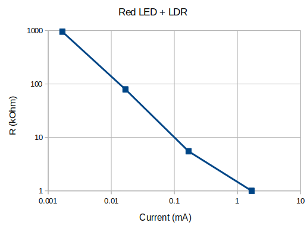
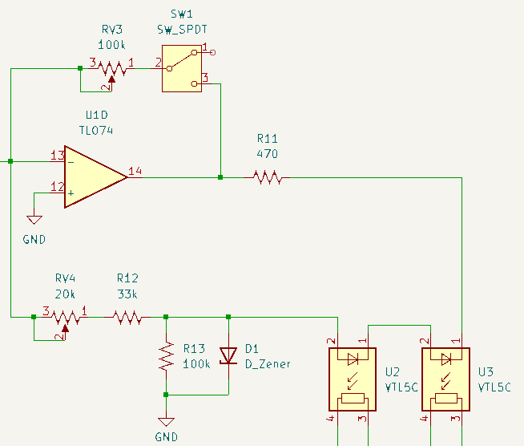
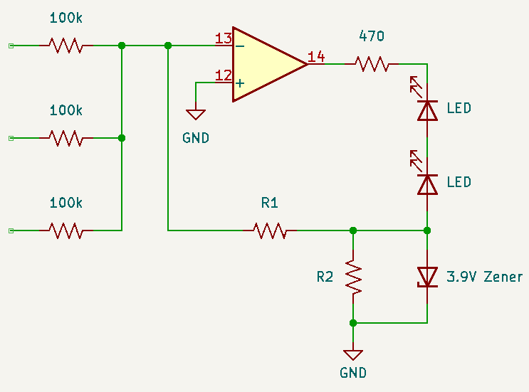
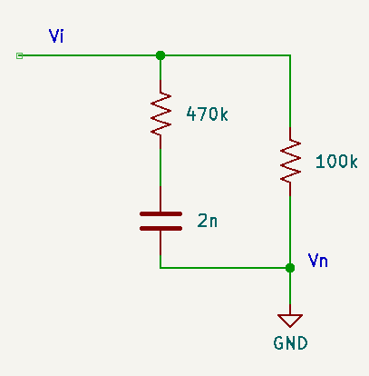

# Theory of Operation

## Sallen-Key Filter

The Sallen-Key filter topology results in a second order filter. In a low-pass configuration, it's often presented in a textbook \[[1](#schaumann)\] as 

In this structure, the gain $K$ is set by the resistor divider $R_3$ & $R_4$  in the feedback path of the opamp. In this non-inverting configuration, the gain is $K=1 + \frac{R_3}{R_4}$. For musical applications, it's helpful to decouple the gain from the buffering behaviour in the opamp \[[2](#lanterman-L26)\] (in the same lecture, Aaron Lanterman illustrates a second variation of the Sallen-Key with an additional buffer, which he labels the "Bach" variation -- the original is more relevant here as it maps to the Buchla implementation for the low pass gate):

The canonical transfer function for the LPF is 

$$
H_{LP}(s)=\frac{\omega_n^2}{s^2 + \left(\omega_n/Q\right)s+\omega_n^2}
$$

Deriving from the circuit

$$
\begin{align*}
\left(1 + sC_gR_2\right) v_o &= v_x\\
\frac{v_i-v_x}{R_1} + \frac{v_o - v_x}{R_2} + sC_f(Kv_o - v_x) &= 0 \\
\to R_2(v_i-v_x)+R_1(v_o - v_x)+sC_fR_1R_2(Kv_o - v_x) &=0 \\
\to R_2v_i - (R_1 + R_2 + sC_f R_1 R_2)v_x + (R_1 + sKC_f R_1 R_2)v_o &= 0 \\
\to R_2v_i - (R_1 + R_2 + sC_f R_1 R_2)(1 + sC_gR_2) v_o + (R_1 + sKC_f R_1 R_2)v_o &= 0 \\
\to R_2v_i - (R_2 + sC_f R_1 R_2 + sC_gR_2 (R_1 + R_2) - sKC_f R_1 R_2 + s^2\omega_n^{-2} R_2)v_o &= 0 \\
\to \omega_n^2v_i - (\omega_n^2 + [(1-K)C_f R_1 + C_gR_1 + C_gR_2)]\omega_n^{-2}s + s^2)v_o &= 0 \\
\to Q = \frac{\sqrt{R_1 R_2 C_f C_g}}{R_1 C_g + R_2 C_g + R_1 C_f (1-K)},\quad \omega_n = \sqrt{\frac{1}{R_1 R_2 C_f C_g}}
\end{align*}
$$

Following the Buchla low-pass gate design, we make the choice $R_1=R_2=R$ (where $R$ will be replaced by a vactrol for voltage control. Other choices include $C_f=C_g$ or both, which also reduces the complexity of the formulas. However, this choice decouples control over $Q$ (via feedback gain $K$ ) and $\omega_n$ (via $R$) and leaves some flexibility to bias $Q$ (if $C_f=C_g=C$, the value $C$ cancels in the expression for $Q$).

$$
\begin{align*}
Q &= \frac{\sqrt{C_f C_g}}{2C_g + C_f(1-K)} \\
\omega_n &= \frac{1}{R}\sqrt{\frac{1}{C_f C_g}}
\end{align*}
$$

## Buchla 292 Style Low-Pass Gate

The Buchla 292 low-pass gate features a Sallen-Key filter with voltage controlled $R_1=R_2=R$ using vactrols. In addition, by switching circuit elements in and out, it can function as a simple VCA. There are many interpretations of it floating around (e.g. \[[4](#bergman-35)\]), with variations including CV mixing, resonance control (and voltage control), etc. Aaron Lanterman has a good analysis of the core \[[3](#lanterman-L27)\], which the following is based on.

The first section is the input buffer with optional 2x gain. Here, $R_1$ provides DC input impedance, $C_1$ blocks DC for audio signals and forms a high-pass with $R_2$ (cutoff < 2Hz). The first opamp is configured as a non-inverting gain of 1 (buffer) or 2: if the switch is closed such that $R_3$ is connected to ground, a gain of 2 is realized.

Next is the filter stage. Here $v_{if}$ comes from the output of the input buffer/gain. 

The filter stage can be simplified by replacing the vactrols with resistors $R$ and cleaning up the switches.

$C_2$ can be neglected (high cutoff LPF). In addition $R_6$ can be neglected relative to $R_5$ when configured as a VCA and a low cutoff HPF to remove charge from $C_4$ when $R\to \infty$. $R_8$ is present to provide a minimum output impedance and can be ignored for this analysis. Finally, the opamp in the feedback path of the Sallen-Key provides gain $1\leq K\leq 2$ for the resonance, and can be simplified schematically.

With the VCF switch closed, the formulas for the Sallen-Key filter apply ( $R_5$ can be neglected: VCF and VCA cannot be closed simultaneously). 

$$
\begin{align*}
\omega_n &= \frac{1}{R}\sqrt{\frac{1}{C_f C_g}} = \frac{4.61\times 10^8}{R} \\
Q &= \frac{\sqrt{C_f C_g}}{2C_g + C_f(1-K)} = \frac{2.17}{2+4.7(1-K)}
\end{align*}
$$

For $0 < Q < \infty$, $K < \frac{2C_g}{C_f} + 1 \simeq 1.4$, which suggests that $RV_1 < 40k\Omega$. When $R$ ranges from $1M\Omega$ to $<10k\Omega$, the cutoff frequency for the low-pass can be tuned between 70Hz and 7kHz. 

When the VCA switch is closed, the VCF switch must be open and the feedback loop is broken. Now we have a resistor divider $2R$  and $R_5=10k\Omega$, which feeds a buffer. There is a modest low-pass effect from $C_4$, with $f_c = \frac{1}{2\pi (2R||R_5) C_g}$. When $R \gg R_5$, this reduces to $\sim 16kHz$, and for $R < R_5$ $f_c$ will be larger, so $C_4$ can be neglected. Consequently, the gain of the VCA can be approximated as $G=\frac{2R_5}{R_5+2R}$ (the factor of two comes from the input stage). This gives the "gate" behaviour: when $R \gg R_5$, the gain $G\to 0$. This condition occurs when the input CV signal is low. Increasing the CV input reduces $R$, ideally resulting in near unity gain. 

The last configuration is "both" or "combo" mode: the input stage has unity gain and the filter stage is a simple first order low-pass with $f_c=\frac{1}{4\pi R C_g}$. Again, increasing the CV input will reduce $R$ and increase the cutoff frequency, opening up the filter.

## Driving the Vactrols

I started with a homemade vactrol: red LED + LDR in two layers of heat shrink. The diode voltage for the LED is 1.68V. Assuming a constant diode drop, the measured response for the "vactrol" is plotted below.

The vactrols are connected in series to make the $R$-$R$ pair in the Sallen-Key filter. From the perspective of the driving circuit \[[5](#natrhythm)\], the vactrols appear as two LEDs in series. A $470\Omega$ resistor is added in series after the cathodes to limit current. A resistor divider circuit moderates the voltage that can appear across the LEDs and current-limiting resistor, and this voltage is also clamped by a 3.9V Zener diode (note that the voltage increases starting from the output of the opamp). An additional branch can be added in parallel with the switch SW1 to absorb some current, which will increase the $R$ of the vactrols and reduce the cutoff frequency/gain in the VCF/VCA. This is labeled "deep" mode \[[5](#natrhythm)\].

The opamp is configured as an inverting amplifier: the inverting input is a virtual ground. Neglecting the secondary branch, we can analyze the current into the LEDs.

A current $i_n$ flows through $R_1$ such that $V_x = -I_n R_1$ (it will be limited to $V_x \geq -V_z\, (= -3.9V)$ by the Zener diode). $R_2$ will then have current $I_2 = I_n\frac{R_1}{R_2}$ flowing from ground into the node $v_x$: the sum $i_n+i_2$ will flow into the diodes as $I_d =I_n(1+\frac{R_1}{R_2})$. In the worst case, the opamp can pull its output to its negative rail ($-12V$). With two diode drops adding $\sim 3.4V$ and limiting the current in the LEDs to 10mA such that the drop across the current limiting resistor is $4.7V$ (dissipates $\sim 50mW$), $v_x$ can reach... drum roll... $-3.9V$. 

#### Zener Diode Activation

How does this circuit end up driving $>1mA$ through the LEDs? At the summing input, peak voltages should not exceed $\sim 10V$, corresponding to currents of $\sim 100\mu A$. Depending on the choice of $R_1$ and $R_2$, the current through $R_1$ may be sufficient to drive the voltage below $ \sim -4V$ while the LEDs are on, and the opamp will reach it's maximum (negative) output voltage. At this point, the opamp will stop behaving ideally: $v_n$ will increase (balancing the input current from the summing network with the current drawn through $R_1$) while the Zener diode will act like an "ideal" $-3.9V$ source, providing current that will be sunk at the opamp output. Note: leaving out the Zener shouldn't impact the VCF behaviour, but will limit the "gate" behaviour as the vactrol won't saturate and drive $R$ to a very low value. 

#### Choosing $R_1$ and $R_2$

When $I_d>100\mu A$, the resistance of the LDR drops below $10k\Omega $ and the cutoff frequency should be $>7kHz$ (i.e. the LPG is "open"). The other constraint is the current $I_n$ at which $|V_x| = V_z$ (the Zener voltage) and the input voltage threshold that corresponds to that current. Assuming a nominal CV input from a gate signal or LFO has a peak voltage of $5V$ ($V_{pp}=10V$), corresponding to a current $I_n=50\mu A$ (through the $100k\Omega$ input mixing resistor) and assuming a ratio between $R_1$ and $R_2$  of $\sim\frac{1}{2}$, $I_D=75\mu A$, leaving some margin for higher CV levels. Choosing $R_2=100k\Omega$ implies $R_1=50k\Omega$. With this value for $R_1$, $I_{n,thresh.} = \frac{V_z}{R_1}=\frac{3.9V}{50k\Omega} = 78\mu A$ or equivalently a CV level of $7.8V$. Just below this threshold, the diode voltage will be $\sim 110\mu A$, and when the threshold is reached, the Zener diode will activate. 

#### Input Mixing and Filtering

In the reference Buchla-inspired designs \[[4](#bergman-35),[5](#natrhythm)\], there are options to buffer the CV inputs (e.g. two mixable CV inputs are available with one passing through an attenuverter). It doesn't seem necessary to to buffer the CV inputs (Ref. [5](#natrhythm) optionally omits them): although the opamp will leave it's normal operating mode and $v_n$ will stop acting like a virtual ground, the currents involved are in the low 10s of $\mu A$ . 

Another interesting feature in \[[4](#bergman-35),[5](#natrhythm)\] is the input filter.

$V_n$ is the virtual ground at the inverting terminal of the opamp, so the current that is directed to the branch with the vactrols will be the sum of the currents in the two branches shown in the circuit above:

$$
I_n = V_i\left(\frac{1}{R_1 + \frac{1}{sC_1}} + \frac{1}{R_2}\right)=V_i\left(\frac{sC_1(R_1 + R_2) + 1}{sR_1R_2 C_1 + R_2} \right)
$$

At low frequencies ($s\to 0$) this reduces to an impedance of $R_2=100k\Omega$ and at high frequencies ($s\to \infty$) it reduces to $R_1\parallel R_2 \simeq 82k\Omega$ with a corner frequency around $170Hz$. This should give a bit of a "pluck" to the filter, briefly opening it a bit more on faster signals.

## References

1. R. Shaumann and M. E. van Valkenburg "Design of Analog Filters," Oxford University Press (2001)
2. A. Lanterman, "ECE4450 L26: Sallen-Key Filters & the Korg MS-20 VCF," [online](https://www.youtube.com/watch?v=beQLUA0BQP4) (retrieved Sept. 2024)
3. A. Lanterman, "ECE4450 L27: Buchla Lowpass Gate," [online](https://www.youtube.com/watch?v=NGz3dDnoVVk) (retrieved Sept. 2024)
4. E. Bergman, "Synthesizer Build Part 35 - Resonant Lopass Gate," [online](https://www.eddybergman.com/2020/10/synthesizer-build-part-35-resonant.html) (retrieved Sept. 2024)
5. T. White, "Resonant Lopass Gate Circuit Board Project," [online](https://naturalrhythmmusic.com/lopass) (retrieved Sept. 2024)

